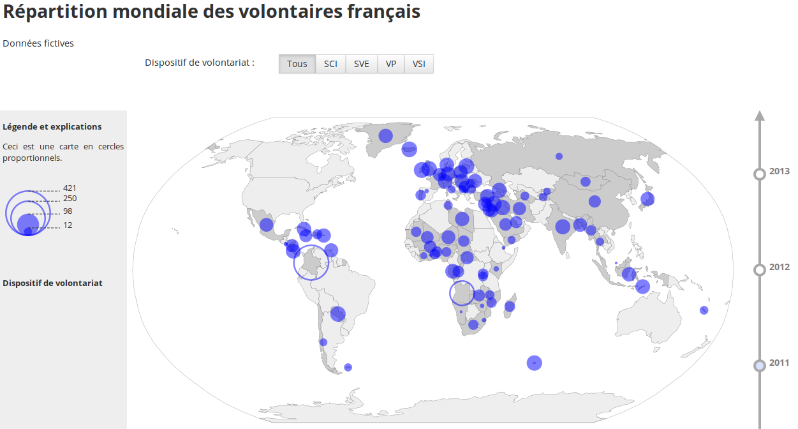

# D3 circle maps

This is a D3 map with proportional circles. You can chose which data is represented, and for which year.

Data is provided as a json of world countries and a CSV with fictional data.

